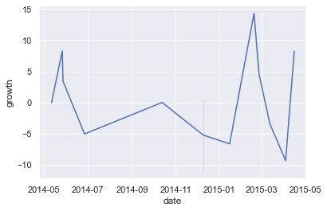

# House Rocket Insights Project
The goal of this project is to create insights through data analysis and manipulation to help the decision making of the Business Team of a fictional company (House Rocket).
Therefore, learning the basics of Data Analysis using python and understanding a little more how it is to work with data.

 
## 1 - Business Problem.

### 1.1 - Description
House Rocket is a property purchase and sales company (fictional).

With that in mind, the purpose of this project is to create insights through data analysis to help the company find the best opportunities. So, the business problem is to choose the best properties to buy so that the company can sell for a bigger price and make profits with it. 

The dataset used in this project comes from the official public records of home sales in the King County area, Washington State.

[Dataset from Kaggle](https://www.kaggle.com/harlfoxem/housesalesprediction)

### 1.2 - Business Questions
 1. What properties should House Rocket buy and at what price?
 2. What is the best moment to sell the bought properties and for what price?

### 1.3 - Business Understanding
**Final Product:**
 - Report with property purchase suggestions with price recomendation;
 - Report with property selling suggestions with price recomendation;
 - Insights to help decide which property should be more interesting for the business.
 - A Cloud Application with interactive dashboards, maps and dataframes.

## 2 - Business assumptions.
- Every property is available for buying, independently of any metric (including price);
- Properties with condition 2 or less are considered not in good condition for purchase;
- Seasons are separeted in 2: Summer (June to November) and Winter (December to May);
- Seasons are considered an affecting metric of price;
- Few data cleaning was made.

## 3 - Solution Planning
- **Buying and Selling Report:**

 **Buying Plan:**

 **Step I** - Collect data from Kaggle;
 
 **Step II** - Group the properties by zipcode (region);
 
 **Step III** - Find the price median by zipcode (market price metric);
 
 **Step IV** - Suggest buying the properties with prices below the market price metric that are in good conditions.
 
 **Step V** - Create a Excel file with all the buying and selling results
 
 
 **Selling Plan:**
 
 **Step I** - Group the properties by season (summer or winter) from its date of post;
 
 **Step II** - Find the price median for each region (zipcode) in each season (summer or winter);
 
 **Step III** - Suggest selling the properties above its zipcode-season-median with a 10% profit margin;
 
 **Step IV** - Suggest selling the properties below its zipcode-season-median with a 30% profit margin.
 
 [Buying and Selling Report (Excel)](https://github.com/Caio-Moretti/Insights-Project/blob/main/buying-selling-report.xlsx)
 
 - **Insights Plan:**

 **Step I** - Make a data analysis based on the hypotesis already made;
 
 **Step II** - Mark them as True or False;
 
 **Step III** - Explain the results obtained for better data understanding.
 
 [Data Analysis and Insights Validation](https://github.com/Caio-Moretti/Insights-Project/blob/main/Data%20Analysis.ipynb)
 
## 4 - Top 5 Business Insights.
**Hypothesis 01:**
Water view properties are, at least, 20% more expensive, on avarege.

**TRUE:** Properties with water view are 212.63% more expensive, on avarege.

|   Waterfront |   Price Mean        |
|-------------:|--------------------:|
|            No |    531558.54       |
|            Yes |        1661876.02 |

**Hypothesis 02:**
Properties built before 1955 are more than 50% cheaper, on avarege.

**FALSE**: The properties built before 1955 are, actually, 4.46% more expensive, on avarage.

|  Sample  | Year Built | Price Mean |
|---:|-----------:|---------------:|
| 53 |       1953 |         490423 |
| 46 |       1946 |         524641 |
| 25 |       1925 |         607219 |
| 28 |       1928 |         621714 |
| 32 |       1932 |         458409 |
|  5 |       1905 |         752978 |
| 50 |       1950 |         490506 |
| 51 |       1951 |         545029 |
| 52 |       1952 |         530437 |
| 10 |       1910 |         671536 |

**Hypothesis 03:**
properties without a basement have a total area, at least, 40% larger than properties with basement, on avarage.

**FALSE**: Properties without basement are 18.41% larger than the ones with basement, on avarage.

| Has Basement |   Size Mean     |
|:---------------|----------------:|
| No            |         16284.2 |
| Yes           |         13287.2 |

**Hypothesis 04:**
The property price growth YoY (Year over Year) is more than 10%.

**FALSE**: The price percentage growth of 2015 over 2014 is 0.52%.

**Hypothesis 05:**
Properties with 3 bathrooms have a price growth of more than 15% per month.

**FALSE**: Properties with 3 bathrooms have a price growth of 0.32% per month, on avarage.

## 5 - Tools used
 - Python 3.9.7;
 - PyCharm;
 - Jupyter Notebook;
 - Excel.

## 6 - Financial Results for the Company

Following the data-driven suggestions made (theoretically buying and selling all avaliable properties), this is the forecast:

|   Nº of Properties |   Total Cost (US$) |   Sales Revenue (US$) |   Profit Mean |
|-------------------:|-------------------:|----------------------:|--------------:|
|              10579 |   4,094,212,008.00 |     5,294,160,803.20  | 1,199,948,795.20 |

## 7 - Conclusion

This project is my first portfolio project and was focused on using python for a real data analysis and data-driven insights.

Thus, this experience was perfect for introducing the basics of a real Data Analysis work and even knowing that there is still a lot to learn, I'm proud of my effort and learning through the process.

About the project, there are some things i would like to add for the project like creating a app so the CEO can control and filter his properties dataset, can instantly see some maps and work with it. I would do this using PyCharm, Streamlit and deploying it with Heroku.

Altough it is not complete, I would consider it as finished, because I was able to learn more how to understand a business problem and make all the proccess based on this plan generating value for the company only by doing some basic analysis.

## 8 - Next Steps
- **Cloud Application Creation Plan:**
 
 **Step I** - Get the address using a Geopy (Python library) tool called Nominatim, which can find the nearest address given the latitude and longitude 
 
 **Step II** - Create a document called App.py and develop a application with interactive filters for dashboards using Streamlit Python library;
 
 **Step III** - Deploy the application at Heroku. (Heroku is a cloud platform as a service that supports multiple programming languages.)
 
 - **Cleaning the dataset better**
